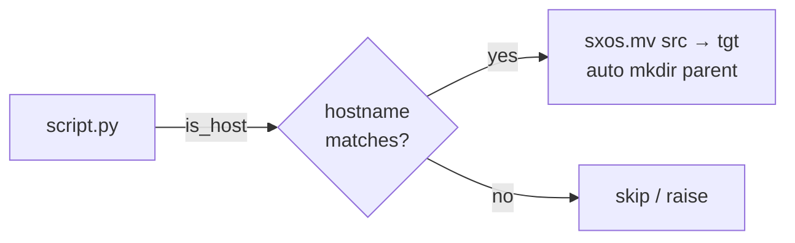

# scitex-os

<p align="center">
  <a href="https://scitex.ai">
    
  </a>
</p>

<p align="center"><b>Host check + safe file move helpers — zero-dep, pure stdlib.</b></p>

<p align="center">
  <a href="https://scitex-os.readthedocs.io/">Full Documentation</a> · <code>uv pip install scitex-os[all]</code>
</p>

<!-- scitex-badges:start -->
<p align="center">
  <a href="https://pypi.org/project/scitex-os/"></a>
  <a href="https://pypi.org/project/scitex-os/"></a>
  <a href="https://github.com/ywatanabe1989/scitex-os/actions/workflows/rtd-sphinx-build-on-ubuntu-latest.yml"></a>
</p>
<p align="center">
  <a href="https://github.com/ywatanabe1989/scitex-os/actions/workflows/pytest-matrix-on-ubuntu-py3-11-3-12-3-13.yml"></a>
  <a href="https://github.com/ywatanabe1989/scitex-os/actions/workflows/install-test.yml"></a>
  <a href="https://codecov.io/gh/ywatanabe1989/scitex-os"></a>
</p>
<!-- scitex-badges:end -->

---

## Problem and Solution

| # | Problem | Solution |
|---|---------|----------|
| 1 | **Host-specific scripts use `socket.gethostname() == 'X'`** -- different style across every repo; no consistent error message when the check fails | **`scitex_os.check_host` / `is_host` / `verify_host`** -- single canonical helper triple; `check_host` and `is_host` return bool, `verify_host` calls `sys.exit(1)` on mismatch |
| 2 | **`os.rename(src, dst)` breaks across filesystems** -- "Invalid cross-device link" when the target is on a different mount | **`scitex_os.mv(src, dst)`** -- atomic when same filesystem, copy+unlink fallback otherwise; auto-creates parent dir |

## Installation

```bash
pip install scitex-os
```

## Quick Start

```python
import scitex_os as sxos

if sxos.is_host("compute-01"):
    sxos.mv(src, tgt)
```

## 1 Interfaces

<details open>
<summary><strong>Python API</strong></summary>

<br>

```python
import scitex_os as sxos

sxos.is_host("hostname")          # bool
sxos.check_host("hostname")       # bool
sxos.verify_host("hostname")      # sys.exit(1) on mismatch

sxos.mv(src, tgt)                 # shutil.move with mkdir(tgt)
```

</details>

## Status

Standalone fork of `scitex.os`. Pure stdlib — zero deps. The umbrella package's
`scitex.os` import path is preserved via a `sys.modules`-alias bridge.

## Architecture

```
scitex_os/
├── _check_host.py        ← is_host / check_host / verify_host
├── _mv.py                ← `mv` (shutil.move + mkdir(target.parent))
└── __init__.py           ← public surface (zero deps beyond stdlib)
```

## Demo



```python
import scitex_os as sxos

if sxos.is_host("compute-01"):
    sxos.mv("results/run.csv", "/shared/runs/2026-05-07/run.csv")
# parent dir is auto-created; cross-filesystem moves are handled.
```

```bash
$ python -c "import scitex_os; print(scitex_os.is_host('laptop'))"
True
```

## Part of SciTeX

`scitex-os` is part of [**SciTeX**](https://scitex.ai). Install via
the umbrella with `pip install scitex[os]` to use as
`scitex.os` (Python) or `scitex os ...` (CLI).

>Four Freedoms for Research
>
>0. The freedom to **run** your research anywhere — your machine, your terms.
>1. The freedom to **study** how every step works — from raw data to final manuscript.
>2. The freedom to **redistribute** your workflows, not just your papers.
>3. The freedom to **modify** any module and share improvements with the community.
>
>AGPL-3.0 — because we believe research infrastructure deserves the same freedoms as the software it runs on.

## License

AGPL-3.0-only (see [LICENSE](./LICENSE)).

---

<p align="center">
  <a href="https://scitex.ai" target="_blank"></a>
</p>
